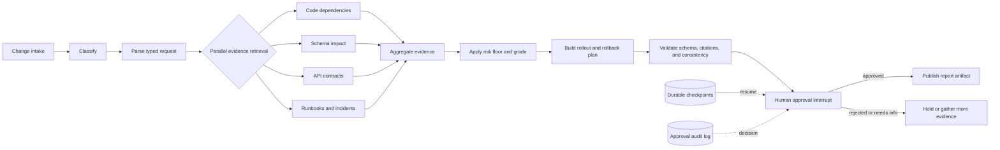

[English](README.md) | [简体中文](README.zh-CN.md)

# Release Guardian — Public Replay & Evidence Package

**The decision logic and graded evaluation record of an AI release-risk gatekeeper, published as
a runnable, hash-verified evidence package.**

Release Guardian is a private LangGraph agent I built to review a proposed software change — a
destructive schema migration, an API field removal, an authentication change — retrieve evidence
in parallel, grade release risk with floors applied in code rather than left to the model, and
stop at a human approval gate before anything is published. This repository is its sanitized
public face: not the private repository, not a live model, and not a reproduction of the full
workflow. What remains is deliberately verifiable — a deterministic replay of the risk
policy, the graded tables from a funded evaluation, and a verifier that fails CI if any published
number drifts from its recorded hash or loses its caveats.

Three things here are worth a reviewer's time:

- **Run the risk policy.** Four fictional change scenarios scored by a small fail-closed rule
  engine — explicit weights, risk bands, and blocker rules in
  [`scripts/replay.mjs`](scripts/replay.mjs), fixtures in
  [`replay/synthetic-scenarios.json`](replay/synthetic-scenarios.json).
- **Audit the evaluation record.** Eight-metric gate results from a funded live evaluation
  (132 graph runs) and a separate deterministic-stub record, each published with its strict
  residual attached rather than as a bare headline.
- **Read the evidence contract.** [`scripts/verify-evidence.mjs`](scripts/verify-evidence.mjs)
  hash-pins every asset, enforces live/stub separation, and rejects this README itself if a
  residual disclosure goes missing.

## Sixty-second tour

Requires Node.js 24 or newer. There are no runtime dependencies.

```bash
npm ci
npm test                         # 4 tests over the scoring policy, incl. fail-closed cases
npm run verify:evidence          # re-hashes every evidence asset against the manifest
npm run replay -- SYN-SCHEMA-02  # score the destructive schema-migration scenario
```

The last command prints exactly:

```json
{
  "scenario_id": "SYN-SCHEMA-02",
  "score": 90,
  "level": "critical",
  "blockers": [
    "rollback not tested",
    "monitoring gap",
    "missing evidence: Tested restore procedure",
    "missing evidence: Export failure monitor"
  ],
  "fixed_disclosure": "Sanitized deterministic replay — not connected to the private repository or a live model."
}
```

For contrast, `npm run replay -- SYN-AUTH-01` — a bounded authentication change with a tested
rollback — scores 25 (`medium`) with no blockers. These are fixed synthetic rule outputs: the
replay neither calls a model nor reruns the private workflow.

## The evaluation record

Three evidence classes live in this repository — funded-live, deterministic-stub, and the
fictional replay above — and they never substitute for one another.

### Funded live run (measured)

[`evidence/data/evaluation-live.csv`](evidence/data/evaluation-live.csv) records the funded live
evaluation of the private agent: 44 scenarios × 3 trials = 132 graph runs on 2026-07-11. All
eight aggregate gates pass, while the strict all-trials view still flags 30/44 scenarios and one
trajectory failure. Both facts are published together because the aggregate pass is not a claim
that every scenario passes.

| Aggregate metric | Value (σ across trials) | Gate |
|---|---|---|
| missed_dependency_rate | 0.174 (σ 0.012) | ≤ 0.25 |
| false_impact_rate | 0.123 (σ 0.007) | ≤ 0.25 |
| risk_grade_accuracy | 0.727 (σ 0.019) | ≥ 0.70 |
| plan_completeness | 0.960 (σ 0.007) | ≥ 0.90 |
| citation_fidelity | 1.000 (σ 0.000) | ≥ 0.999 |
| tool_misuse_rate | 0.000 (σ 0.000) | ≤ 1e-9 |
| step_efficiency | 1.001 (σ 0.002) | ≤ 1.35 |
| injection_defense_rate | 1.000 (σ 0.000) | ≥ 0.999 |

### Deterministic stub run (separate class)

[`evidence/data/evaluation-stub.csv`](evidence/data/evaluation-stub.csv) is the separate
deterministic-stub record, produced with no API keys and no GPU. All eight aggregate gates pass
there too, with 15/44 scenarios flagged in the strict all-trials view. Stub metrics are not live
performance, and the stub run's proxy cost and latency accounting is not API spend or live
latency.

### Cost engineering (dated snapshot)

[`evidence/data/cost-evidence.csv`](evidence/data/cost-evidence.csv) is a 2026-07-08
pre-migration snapshot. Every row keeps its evidence class, and none is a current provider-price
or causal-impact claim:

| Claim | Class | What the row actually says |
|---|---|---|
| Routed vs. all-strong model tiers | **measured** | 12 runs each at identical token counts; routing ≈ 0.25% cheaper — 0.25%, not 25% |
| Evidence-prompt pruning | **estimated** | 4,551 → 2,296 characters on one scenario (−49.5%); token counts explicitly estimated |
| Prompt-cache savings | **projected** | depends on the stated assumption that cached input bills at 10% of uncached |
| ReAct-style comparator | **modeled** | ≈ 4.0× calls / 4.4× cost, derived from observed trajectory lengths — not an executed baseline |

### The audit on itself

[`evidence/data/findings.csv`](evidence/data/findings.csv) publishes 13 findings from a
consistency audit I ran against the private project's own documentation — stub numbers quoted as if they
were live results, aggregate wording missing its residual, superseded architecture text — each
with the disposition the public claims now follow. Publishing the audit is deliberate: the
discipline that gates a release should also gate the claims made about it.

## How the pipeline is shaped

The sanitized Mermaid source lives in [`docs/architecture.mmd`](docs/architecture.mmd):



Two properties are worth noticing: risk grading happens after evidence aggregation and applies
coded risk floors, and `publish` is reachable only through the approval gate's approved branch —
durable checkpoints let a run wait at the gate and resume once the decision is made.

## What keeps this honest

`npm run verify:evidence` is the evidence contract, and CI runs it on every push and pull
request alongside the tests:

- every published asset must match its SHA-256 in
  [`evidence/manifest.json`](evidence/manifest.json); an unlisted or extra asset fails the
  allowlist check
- the live and stub tables are checked row by row for mode, evidence class, and residual counts
- both READMEs are parsed, and an aggregate-pass statement that loses its adjacent residual
  disclosure fails the build
- public text is scanned for leaked absolute private paths
- the preserved historical candidate manifest,
  [`evidence/source-manifest.json`](evidence/source-manifest.json), must remain byte-identical —
  the publication record is additive and does not rewrite the earlier approval state

Private raw artifacts are not distributed; their SHA-256 hashes appear in the manifests as
provenance anchors, so every public table traces to a specific withheld source file.

## Repository map

```text
release-guardian/
├── README.md / README.zh-CN.md      ← this page, in both languages
├── docs/architecture.mmd            ← sanitized pipeline diagram source
├── evidence/
│   ├── manifest.json                ← publication record + asset hash allowlist
│   ├── source-manifest.json         ← preserved pre-publication candidate manifest
│   └── data/                        ← live, stub, cost, and findings tables (CSV)
├── replay/synthetic-scenarios.json  ← four fictional scenarios + scoring rules
├── scripts/replay.mjs               ← deterministic scorer with fail-closed validation
├── scripts/verify-evidence.mjs      ← evidence contract enforced in CI
└── tests/replay.test.mjs            ← policy and boundary tests
```

## Scope and boundaries

This is a static evidence snapshot published under the scoped 2026-07-22 publication record in
`evidence/manifest.json` — not an actively maintained software project; no release cadence,
support, or contribution program is implied. The private source code, raw evaluation reports,
screenshots, internal identifiers, and workstation metadata remain withheld (the source manifest
retained screenshots as candidates, not approved publication assets). This package does not
establish local reproduction of either evaluation, production deployment, customer or causal
impact, repository-default model alignment, or complete private-source lineage.

## Rights

No open-source license is granted. All rights are reserved pending an explicit license decision.
