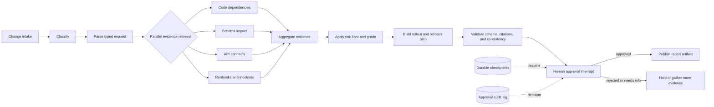

[English](README.md) | [简体中文](README.zh-CN.md)

# Release Guardian — 公开复演与证据包

**一个 AI 发布风险把关者的决策逻辑与分级评估记录，以可运行、经哈希校验的证据包形式发布。**

Release Guardian 是我构建的一个私有 LangGraph 代理，用于审查拟议的软件变更——破坏性 schema 迁移、API 字段移除、认证变更——并行检索证据，用代码中强制应用的下限（而非交给模型）来评定发布风险，并在任何内容发布之前停在人工审批闸门处。本仓库是其经脱敏的公开面貌：不是私有仓库，不是实时模型，也不是完整工作流的复现。留下的内容是刻意可验证的——风险策略的确定性复演、来自一项受资助评估的分级表格，以及一个在任何已发布数字偏离其记录哈希或丢失其保留说明时会让 CI 失败的验证器。

这里有三样东西值得评审者花时间：

- **运行风险策略。** 四个虚构变更场景由一个小型 fail-closed 规则引擎评分——显式权重、风险等级区间与阻断规则见
  [`scripts/replay.mjs`](scripts/replay.mjs)，夹具见
  [`replay/synthetic-scenarios.json`](replay/synthetic-scenarios.json)。
- **审计评估记录。** 来自一项受资助实时评估（132 次图运行）的八指标闸门结果，以及一份独立的确定性存根记录，各自都附带其严格残差一起发布，而非裸标题数字。
- **阅读证据契约。** [`scripts/verify-evidence.mjs`](scripts/verify-evidence.mjs) 对每个资产做哈希固定，强制 live/stub 分离，并且如果某条残差披露缺失，会拒绝本 README 本身。

## 六十秒导览

需要 Node.js 24 或更新版本。没有运行时依赖。

```bash
npm ci
npm test                         # 4 tests over the scoring policy, incl. fail-closed cases
npm run verify:evidence          # re-hashes every evidence asset against the manifest
npm run replay -- SYN-SCHEMA-02  # score the destructive schema-migration scenario
```

最后一条命令会精确打印：

```json
{
  "scenario_id": "SYN-SCHEMA-02",
  "score": 90,
  "level": "critical",
  "blockers": [
    "rollback not tested",
    "monitoring gap",
    "missing evidence: Tested restore procedure",
    "missing evidence: Export failure monitor"
  ],
  "fixed_disclosure": "Sanitized deterministic replay — not connected to the private repository or a live model."
}
```

作为对比，`npm run replay -- SYN-AUTH-01`——一个带有已测试回滚的有界认证变更——得分 25（`medium`），无阻断项。这些是固定的合成规则输出：复演既不调用模型，也不重跑私有工作流。

## 评估记录

本仓库中存在三类证据——受资助实时、确定性存根，以及上面的虚构复演——它们从不互相替代。

### 受资助实时运行（measured）

[`evidence/data/evaluation-live.csv`](evidence/data/evaluation-live.csv) 记录了私有代理的受资助实时评估：44 个场景 × 3 次试验 = 132 次图运行，日期为 2026-07-11。全部八个聚合闸门通过，而严格的全试验视角仍标记 30/44 个场景和一次轨迹失败。两个事实一起发布，因为聚合通过并不是每个场景都通过的声明。

| 聚合指标 | 数值（跨试验 σ） | 闸门 |
|---|---|---|
| missed_dependency_rate | 0.174 (σ 0.012) | ≤ 0.25 |
| false_impact_rate | 0.123 (σ 0.007) | ≤ 0.25 |
| risk_grade_accuracy | 0.727 (σ 0.019) | ≥ 0.70 |
| plan_completeness | 0.960 (σ 0.007) | ≥ 0.90 |
| citation_fidelity | 1.000 (σ 0.000) | ≥ 0.999 |
| tool_misuse_rate | 0.000 (σ 0.000) | ≤ 1e-9 |
| step_efficiency | 1.001 (σ 0.002) | ≤ 1.35 |
| injection_defense_rate | 1.000 (σ 0.000) | ≥ 0.999 |

### 确定性存根运行（独立类别）

[`evidence/data/evaluation-stub.csv`](evidence/data/evaluation-stub.csv) 是独立的确定性存根记录，在无 API 密钥、无 GPU 的条件下产生。那里同样全部八个聚合闸门通过，严格全试验视角标记 15/44 个场景。存根指标不是实时性能，存根运行的代理成本与延迟核算也不是 API 支出或实时延迟。

### 成本工程（带日期快照）

[`evidence/data/cost-evidence.csv`](evidence/data/cost-evidence.csv) 是 2026-07-08 的迁移前快照。每一行都保留其证据类别，且没有任何一行是当前供应商价格或因果影响声明：

| 声明 | 类别 | 该行实际所说 |
|---|---|---|
| 路由 vs 全强模型档位 | **measured** | 各 12 次运行在相同 token 数下；路由约便宜 0.25%——是 0.25%，不是 25% |
| 证据提示剪枝 | **estimated** | 单场景 4,551 → 2,296 字符（−49.5%）；token 数明确为估计 |
| 提示缓存节省 | **projected** | 取决于所述假设：缓存输入按未缓存的 10% 计费 |
| ReAct 式对照 | **modeled** | ≈ 4.0× 调用 / 4.4× 成本，由观测到的轨迹长度推导——不是已执行的基线 |

### 对自身的审计

[`evidence/data/findings.csv`](evidence/data/findings.csv) 公布了 13 条发现，来自我对私有项目自身文档运行的一致性审计——把存根数字引用得仿佛实时结果、聚合措辞丢失其残差、已被取代的架构文字——每条都附带公开声明现在遵循的处置。发布该审计是刻意的：把关一次发布的纪律，也应当把关关于它所作出的声明。

## 流水线的形态

脱敏的 Mermaid 源文件位于 [`docs/architecture.mmd`](docs/architecture.mmd)：



有两个性质值得注意：风险分级发生在证据聚合之后并应用编码化的风险下限，而 `publish` 只能经由审批闸门的 approved 分支到达——持久检查点让一次运行可以在闸门处等待，并在决定作出后恢复。

## 是什么保持这份诚实

`npm run verify:evidence` 就是证据契约，CI 在每次 push 和 pull request 上都会与测试一起运行它：

- 每个已发布资产必须匹配其在
  [`evidence/manifest.json`](evidence/manifest.json) 中的 SHA-256；未列出或多出的资产会使允许列表检查失败
- live 与 stub 表格逐行检查模式、证据类别与残差计数
- 两份 README 都会被解析，丢失其相邻残差披露的聚合通过陈述会使构建失败
- 公开文本会被扫描以查找泄漏的绝对私有路径
- 被保留的历史候选清单
  [`evidence/source-manifest.json`](evidence/source-manifest.json) 必须保持字节完全一致——发布记录是追加式的，不改写较早的审批状态

私有原始工件不对外分发；它们的 SHA-256 哈希作为来源锚点出现在清单中，因此每张公开表格都可追溯到一个特定的被保留源文件。

## 仓库地图

```text
release-guardian/
├── README.md / README.zh-CN.md      ← this page, in both languages
├── docs/architecture.mmd            ← sanitized pipeline diagram source
├── evidence/
│   ├── manifest.json                ← publication record + asset hash allowlist
│   ├── source-manifest.json         ← preserved pre-publication candidate manifest
│   └── data/                        ← live, stub, cost, and findings tables (CSV)
├── replay/synthetic-scenarios.json  ← four fictional scenarios + scoring rules
├── scripts/replay.mjs               ← deterministic scorer with fail-closed validation
├── scripts/verify-evidence.mjs      ← evidence contract enforced in CI
└── tests/replay.test.mjs            ← policy and boundary tests
```

## 范围与边界

这是一个静态证据快照，依据 `evidence/manifest.json` 中限定范围的 2026-07-22 发布记录发布——不是一个积极维护的软件项目；不暗示任何发布节奏、支持或贡献计划。私有源代码、原始评估报告、截图、内部标识符与工作站元数据仍被保留（源清单将截图保留为候选，而非已批准的发布资产）。本包不确立任一评估的本地复现、生产部署、客户或因果影响、仓库默认模型对齐，或完整的私有源代码谱系。

## 权利

未授予任何开源许可证。在明确的许可决定作出之前，保留所有权利。
